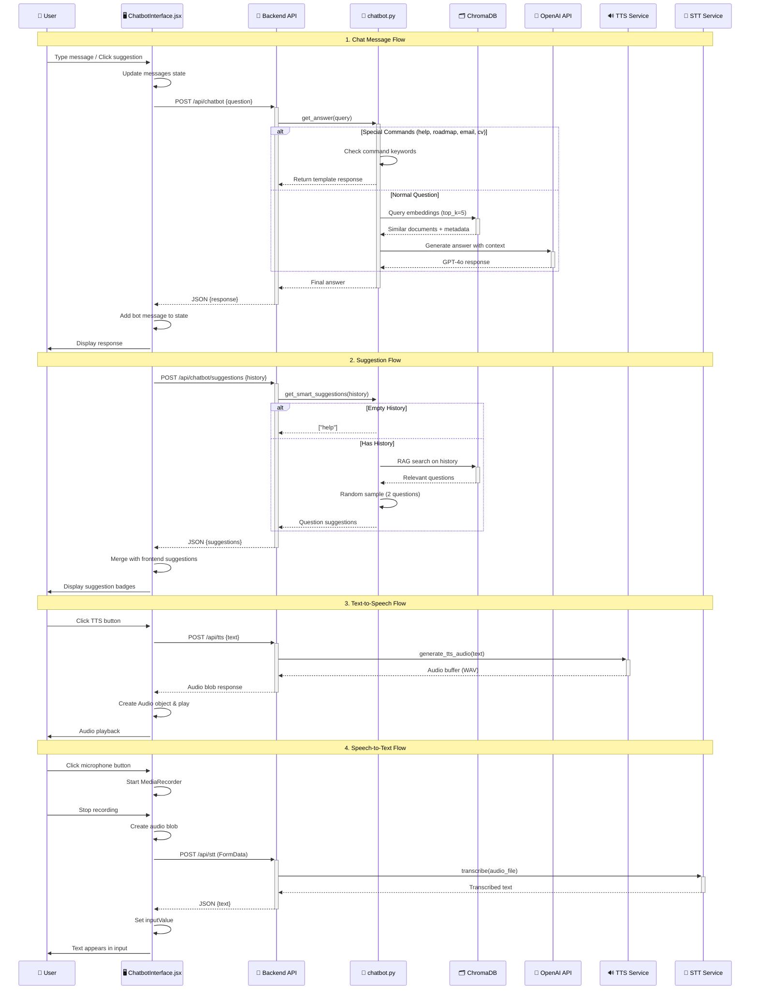
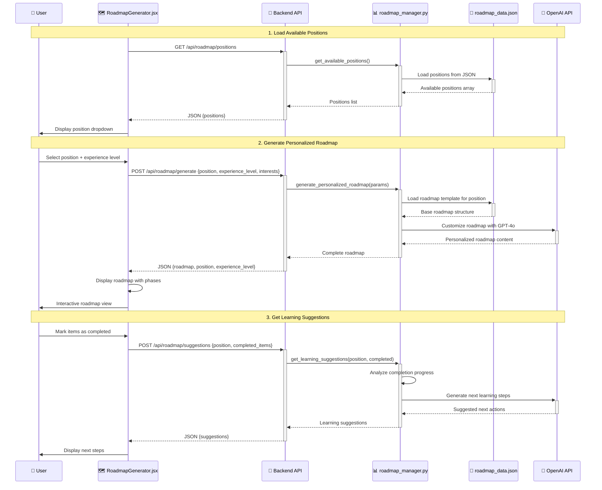
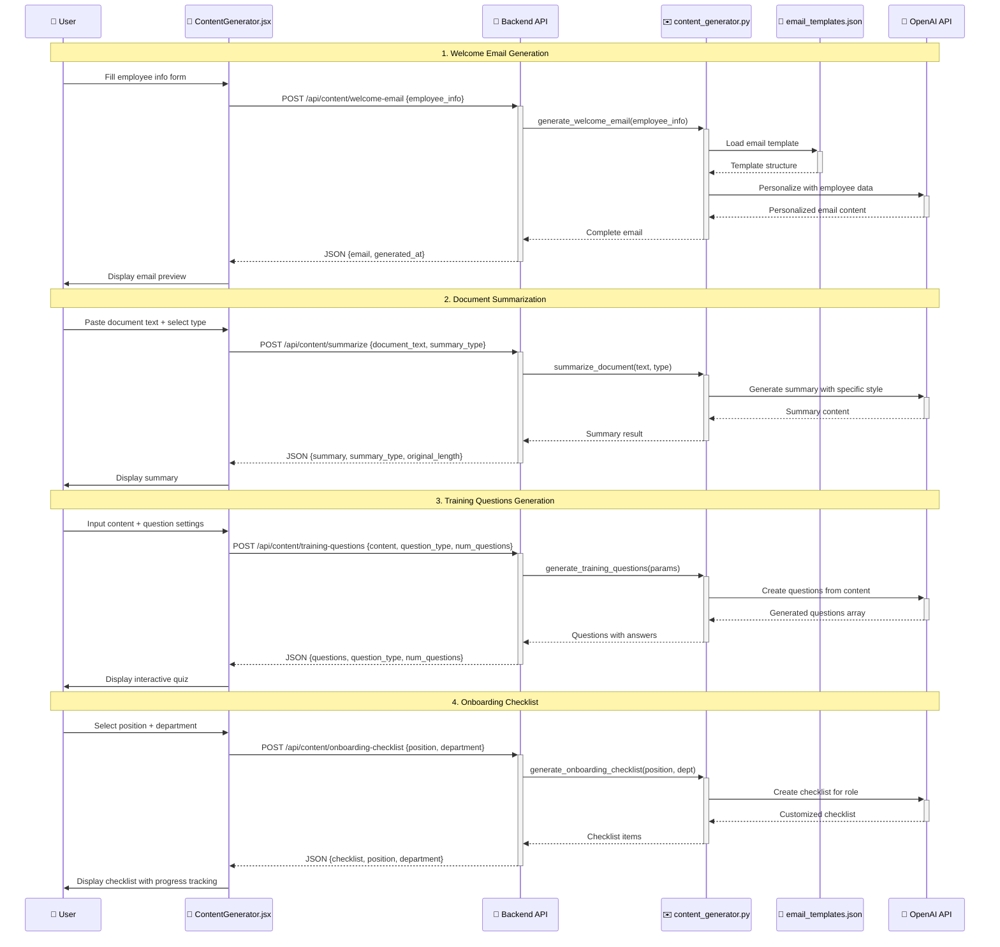
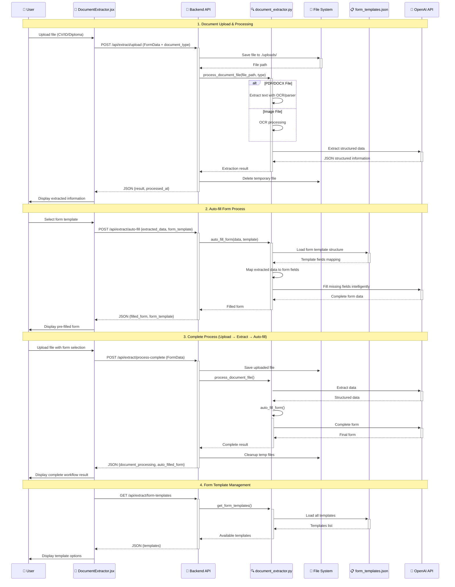
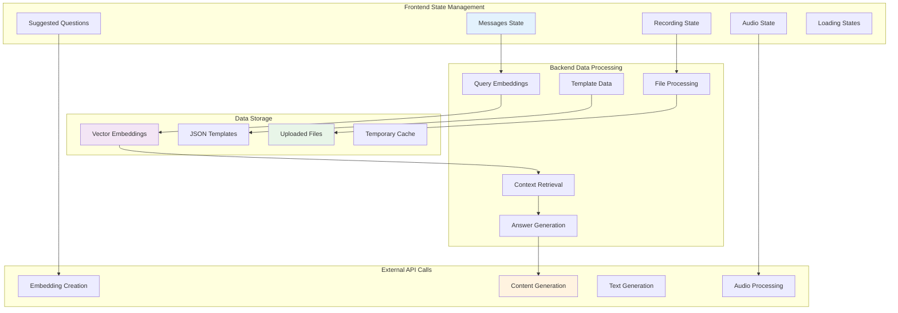

# Luồng Dữ liệu Hệ thống Onboarding Chatbot

## 1. Luồng Chatbot AI (Chat Flow)

## 2. Luồng Roadmap Generator

## 3. Luồng Content Generator

## 4. Luồng Document Extractor

## 5. Các thành phần dữ liệu chính

## Đặc điểm luồng dữ liệu:

### 🔄 **Xử lý Realtime:**
- STT/TTS: Xử lý audio theo thời gian thực
- Suggestions: Cập nhật động theo lịch sử chat
- State Management: React hooks quản lý trạng thái UI

### 🧠 **AI Integration:**
- Vector Search: ChromaDB cho tìm kiếm ngữ nghĩa
- GPT-4o: Sinh nội dung thông minh
- RAG: Retrieval-Augmented Generation cho chatbot

### 📁 **File Processing:**
- Multipart Upload: Xử lý file đa định dạng
- Temporary Storage: Cleanup tự động sau xử lý
- OCR Integration: Trích xuất text từ images

### 🔐 **Error Handling:**
- Try-catch wrapping ở mọi API calls
- Fallback responses cho AI failures  
- User feedback cho các lỗi network