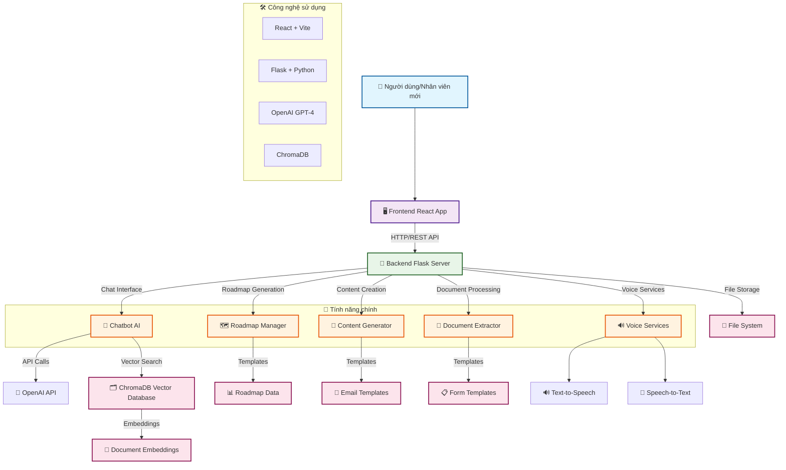

# Sơ đồ Tổng quan Hệ thống Onboarding Chatbot

## Mô tả tổng quan:

### 🏗️ Kiến trúc hệ thống:
- **Frontend**: React SPA với Vite, sử dụng Tailwind CSS và Radix UI
- **Backend**: Flask REST API với Python
- **Database**: ChromaDB để lưu trữ vector embeddings
- **AI Engine**: OpenAI GPT-4 cho xử lý ngôn ngữ tự nhiên

### 🎯 4 chức năng chính:
1. **Chatbot AI**: Trả lời câu hỏi về chính sách, quy trình công ty
2. **Roadmap Manager**: Tạo lộ trình onboarding cá nhân hóa theo vị trí
3. **Content Generator**: Tự động tạo email, tóm tắt, câu hỏi đào tạo
4. **Document Extractor**: Trích xuất thông tin từ CV, tự động điền form

### 🔄 Luồng hoạt động:
1. Người dùng tương tác qua giao diện React
2. Frontend gửi request đến Flask API
3. Backend xử lý qua các module chuyên biệt
4. Sử dụng AI và vector database để tìm kiếm/sinh nội dung
5. Trả kết quả về frontend để hiển thị